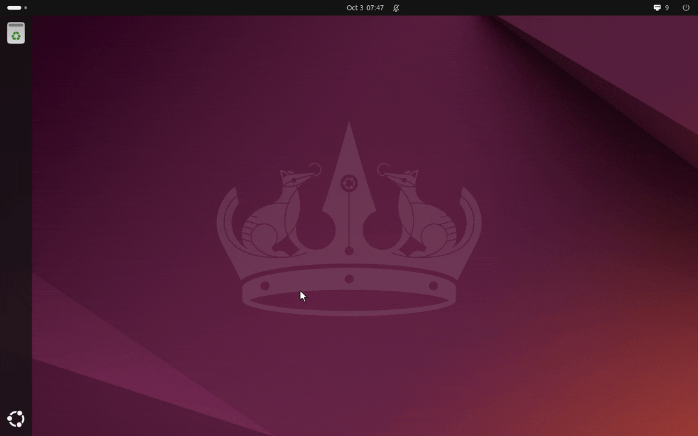
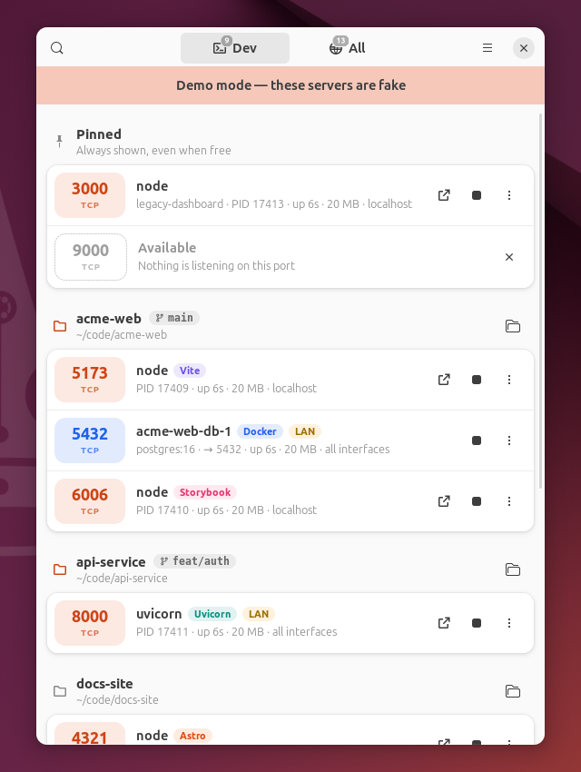
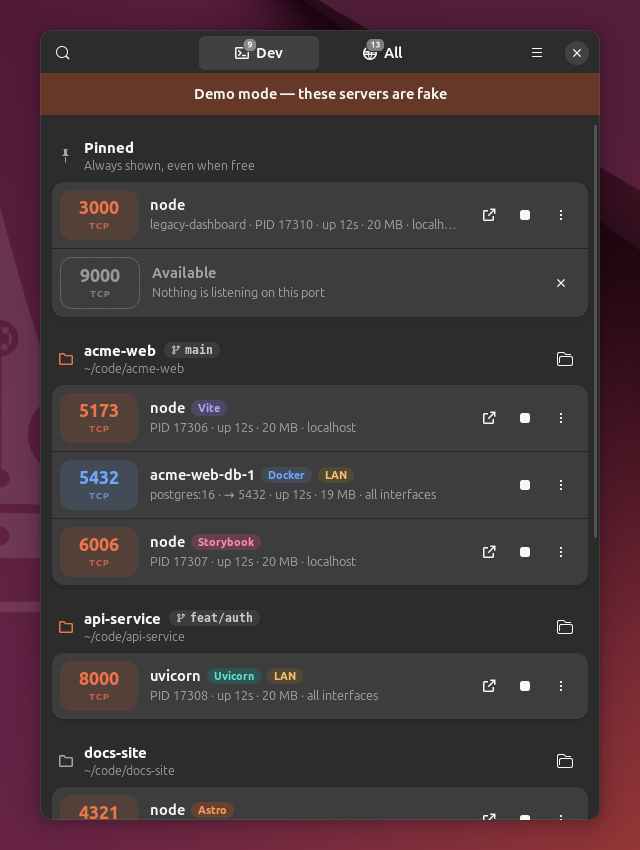
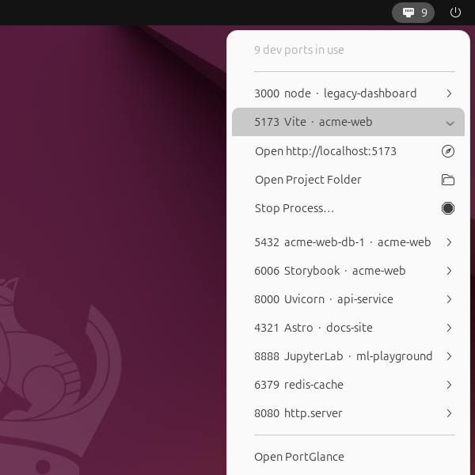
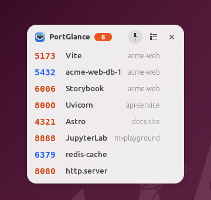

<div align="center">


# PortGlance

**See which dev servers are listening, and which project each one came from, at a glance.**

A top-panel indicator and GTK 4 / libadwaita app for Linux, for everyone who keeps
running into *“port 3000 is already in use”*.

[](https://github.com/rafay-ah/portglance/actions/workflows/ci.yml)
[](LICENSE)



</div>

## Features

- **Top-panel indicator** with the number of dev ports in use. Click it for the list; each
  port can be opened in the browser, revealed in the file manager or stopped from there.
- **Grouped by project.** Every listener is traced to the git repository its process runs
  in (working directory, walked up to the repository root), shown with the current branch.
- **The details that matter:** port, protocol, process, PID, uptime, memory, and where it
  listens, with a **LAN** badge when other machines on your network can reach it.
- **Docker and Podman.** Published ports with container names and images; Compose
  services appear under the project they belong to.
- **One-click stop** with confirmation: SIGTERM first, SIGKILL if the process is still
  running after a timeout (5 s by default). Containers are stopped through the Engine API.
- **Click a port to open `http://localhost:PORT`.** Databases and other non-HTTP services
  are recognized; clicking them copies their address instead.
- **No noise.** System services, other users' processes, desktop apps and random high
  ports stay out of the way unless you switch to **All**.
- **Pinned ports** stay at the top and show *Available* while nothing uses them.
- **Desktop widget** that can stay above your other windows.
- **Starts on login** (on by default, one switch in Preferences to turn it off).
- **Light on resources.** No root, no scanning every process on a timer, no background
  daemon besides the app itself. [How it works](#how-it-works).
- **Terminal commands** too: `portglance list`, `portglance kill 3000`.

## Screenshots

| Light | Dark |
| :---: | :---: |
|  |  |

| Top-panel menu | Desktop widget |
| :---: | :---: |
|  |  |

## Install

PortGlance needs GTK 4.12+ and libadwaita 1.5+, which means Ubuntu 24.04, Debian 13,
Fedora 40 or newer. The AppImage brings its own copies.

For the top-panel indicator, GNOME needs AppIndicator support. **Ubuntu ships it enabled.**
On Fedora and other vanilla GNOME systems install
[AppIndicator and KStatusNotifierItem Support](https://extensions.gnome.org/extension/615/appindicator-support/).
KDE Plasma, Cinnamon, Budgie and XFCE support indicators out of the box.

### Debian and Ubuntu

Download `portglance_<version>_all.deb` from the
[latest release](https://github.com/rafay-ah/portglance/releases/latest), then:

```sh
sudo apt install ./portglance_0.1.0_all.deb
```

### AppImage

Download `PortGlance-<version>-x86_64.AppImage` from the
[latest release](https://github.com/rafay-ah/portglance/releases/latest), then:

```sh
chmod +x PortGlance-0.1.0-x86_64.AppImage
./PortGlance-0.1.0-x86_64.AppImage
```

It bundles Python, GTK 4 and libadwaita and runs on distributions with glibc 2.39 or
newer. Without FUSE, add `--appimage-extract-and-run`.

### From source

```sh
sudo apt install python3-gi gir1.2-gtk-4.0 gir1.2-adw-1
git clone https://github.com/rafay-ah/portglance.git
cd portglance
python3 -m portglance
```

On first start PortGlance adds itself to your login applications; turn that off in
**Preferences → Start on Login**.

## Try it without your own servers

```sh
portglance --demo
```

Demo mode creates a few throwaway projects (git repositories, a plain folder and a Compose
stack) and starts nine fake servers in them that look like Vite, Storybook, Uvicorn,
JupyterLab and friends, including one that ignores SIGTERM so you can watch the SIGKILL
fallback. Docker containers are simulated, so you do not need Docker. Your settings and
login entry are left alone, and everything is removed when you quit.

## Using PortGlance

- **Panel indicator.** Click for the list of dev ports. Expand a port to open it, show its
  project folder or stop it. Middle-click opens the main window.
- **Main window.** *Dev* shows your dev servers, *All* everything that listens. Click a row
  to open it in the browser, ■ to stop it, ⋮ for more: copy the URL, PID or command line,
  open the project folder, pin the port, or kill it right away.
- **Closing the window** keeps PortGlance running in the panel. Use *Quit* in either menu to
  exit.
- **Desktop widget.** Turn it on from the panel menu, the main menu, or `portglance --widget`.
  Drag it anywhere; the pin button keeps it above other windows (see
  [Keeping the widget on top](#keeping-the-widget-on-top)).

| Shortcut | Action |
| --- | --- |
| <kbd>Ctrl</kbd>+<kbd>F</kbd> | Search ports, processes and projects |
| <kbd>Alt</kbd>+<kbd>1</kbd> / <kbd>Alt</kbd>+<kbd>2</kbd> | *Dev* / *All* |
| <kbd>Ctrl</kbd>+<kbd>R</kbd> or <kbd>F5</kbd> | Refresh now |
| <kbd>Ctrl</kbd>+<kbd>,</kbd> | Preferences |
| <kbd>Ctrl</kbd>+<kbd>W</kbd> | Close the window (PortGlance keeps running) |
| <kbd>Ctrl</kbd>+<kbd>Q</kbd> | Quit |

### In the terminal

```console
$ portglance list
PORT  PID    PROCESS             KIND        PROJECT               UPTIME  MEMORY  LISTENING ON
3000  48211  node                Next.js     shop (main)           2h 14m  182 MB  localhost
5432  2311   shop-db-1 [docker]  Docker      shop (main)           2h 15m  48 MB   all interfaces
8000  48302  uvicorn             Uvicorn     api/src (feat/auth)   35m     64 MB   all interfaces
8888  51007  jupyter-lab         JupyterLab  ml-playground (main)  3h 2m   210 MB  localhost

4 system port(s) hidden. Use --all to show them.

$ portglance kill 3000
Stop Next.js (node, PID 48211, shop) on port 3000? [y/N] y
Sending SIGTERM to node (PID 48211)…
Stopped in 0.3s.
```

`list` takes `--all`, `--udp` and `--json`; `kill` takes `--yes`, `--timeout SECONDS` and
`--force` (SIGKILL straight away). `portglance doctor` reports what PortGlance finds on your
system, which is handy for bug reports.

## How it works

**Listening sockets** come straight from the kernel's tables in `/proc/net/tcp` and
`/proc/net/tcp6` (UDP on request). No root is needed.

**Socket owners** are found by reading the `/proc/<pid>/fd` links, the expensive part, so it
only happens when a socket shows up that has not been seen before, and the result is cached.
On a quiet system a refresh is a handful of small file reads: with about 300 processes
and 21,000 open files, the first scan takes ~45 ms and every refresh after it ~1 ms.
(`psutil.net_connections()`, by comparison, walks every file descriptor of every process
on each call.)

**Updates are event-driven where Linux allows it.** Every listening process is watched
through a pidfd, so a server that exits disappears from the list immediately. New listeners
are picked up by the cheap check above, every 3 seconds while a window is open and less
often when only the indicator is visible. Container changes come from the Docker/Podman
event stream.

**Projects.** The process's working directory is walked up to the nearest `.git`
(worktrees and submodules included), so a server started in `shop/apps/web` belongs to
`shop`. Without a repository, the nearest folder with a project file (`package.json`,
`pyproject.toml`, `Cargo.toml`, `go.mod`, …) is used. For processes started from `/` or
your home folder, such as systemd services, script and virtualenv paths in the command
line are tried. A dotfiles repository in `$HOME` is ignored. Compose containers use the
`com.docker.compose.project.working_dir` label.

**Stopping** sends SIGTERM through a pidfd, so a PID that was reused in the meantime can
never be hit, then SIGKILL if the process outlives the timeout. Pre-fork workers that
share the socket (Gunicorn, Uvicorn with `--reload`) are included.

**The indicator** implements the StatusNotifierItem and dbusmenu D-Bus protocols directly,
because GTK 4 has no tray API and libayatana-appindicator is GTK 3 only.

### What counts as a dev port

A port shows up under *Dev* when it is pinned, published by a container, or a TCP port
that is owned by you, sits outside the kernel's ephemeral range (32768–60999), does not
belong to a known desktop app (Spotify, Steam, Discord, browsers, …), and whose process
either belongs to a project or is a known dev runtime or framework (Node, Python, Ruby,
Go, Java, PHP, Deno, Bun, databases, …). Everything else is under *All*. Pin a port to
keep it under *Dev* regardless.

### Keeping the widget on top

Wayland does not let applications raise their own windows above others. On GNOME,
PortGlance ships a tiny optional GNOME Shell extension that does it for the widget only:
**Preferences → Keep the Widget on Top → Install**, then log out and back in once. On X11
the pin works without it. You can always use <kbd>Alt</kbd>+<kbd>Space</kbd> →
*Always on Top* instead.

## Troubleshooting

- **No indicator in the top bar.** On GNOME, make sure an AppIndicator extension is
  installed and enabled (`portglance doctor` tells you whether a panel host is running).
- **No containers.** PortGlance talks to `/var/run/docker.sock`, rootless Docker, or
  Podman's socket (`systemctl --user enable --now podman.socket`). For Docker you need to
  be in the `docker` group.
- **A port shows “owned by root” and cannot be stopped.** Linux hides other users'
  processes from you, and PortGlance never asks for root. Pin the port to keep an eye on
  it; `sudo fuser -k PORT/tcp` stops it.

## Development

```sh
git clone https://github.com/rafay-ah/portglance.git
cd portglance
python3 -m venv --system-site-packages .venv    # sees the system's PyGObject
. .venv/bin/activate
pip install -e '.[dev]'

python -m portglance --demo     # run the app against fake servers
pytest                          # the GTK smoke test runs when a display is available
ruff check . && ruff format --check .
```

```text
portglance/
├── core/            # no GTK: /proc parsing, projects, Docker, stopping, settings
├── ui/              # GTK 4 / libadwaita: window, rows, indicator, widget, preferences
├── demo/            # fake servers for --demo
├── shell-extension/ # optional GNOME Shell helper that keeps the widget on top
├── cli.py           # portglance list / kill / doctor, and the app entry point
└── data/icons/
packaging/           # .deb and AppImage build scripts
tests/               # pytest, including a fake /proc for project mapping
```

Packages are built by `packaging/deb/build-deb.sh` and
`packaging/appimage/build-appimage.sh` into `dist/`. Pushing a tag `vX.Y.Z` (matching
`__version__` in `portglance/__init__.py`), or running the *Release* workflow with that tag
from the Actions tab, builds both, tests them, and publishes a GitHub release with them and
their checksums.

## License

[MIT](LICENSE)
